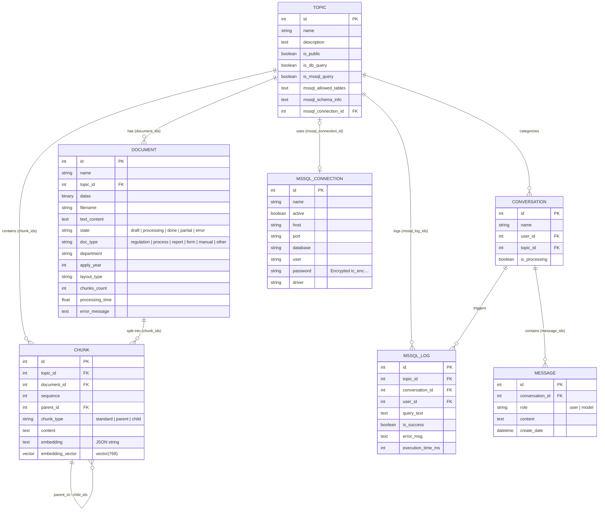
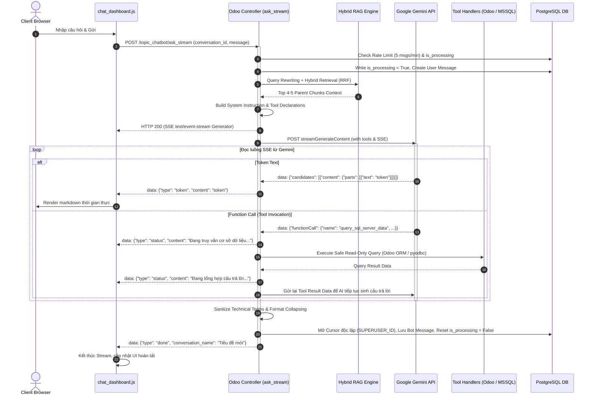

# Kiến trúc Kỹ thuật Module Topic Chatbot (RAG & Enterprise AI Assistant)

Tài liệu này mô tả toàn diện và chi tiết kiến trúc hệ thống, luồng dữ liệu, các mô hình thực thể, thuật toán tìm kiếm RAG và cơ chế tích hợp cơ sở dữ liệu của module `topic_chatbot` trên nền tảng **Odoo 17**.

---

## 1. Tổng quan Kiến trúc Hệ thống (Overall Architecture)

Module `topic_chatbot` được thiết kế theo kiến trúc **Enterprise Generative AI Assistant & Multi-Source RAG** chạy native trên Odoo 17, tích hợp **Google Gemini API** (hỗ trợ các dòng model thế hệ mới: Gemini 3.6 Flash, Gemini 3.5 Flash, Gemini 3.5 Flash-Lite, Gemini 3.1 Pro Preview, Gemini Embedding 2).

Hệ thống cung cấp 3 năng lực cốt lõi:
1. **Multi-Format Knowledge Base (RAG):** Tự động xử lý, OCR thích ứng, trích xuất cấu trúc ngữ nghĩa và lập chỉ mục Vector/FTS cho các tài liệu định dạng PDF, DOCX, XLSX, XLS, CSV, TXT.
2. **Odoo ERP Data Tool (`query_odoo_data`):** Tra cứu dữ liệu nghiệp vụ nội bộ (Nhân sự, Phòng ban, Kết quả KPI) qua ORM an toàn (Read-Only).
3. **Microsoft SQL Server Data Tool (`query_sql_server_data`):** Kết nối trực tiếp đến các máy chủ SQL Server bên ngoài với cơ chế mã hóa mật khẩu Fernet AES-128, kiểm soát T-SQL nghiêm ngặt và tự động đồng bộ Schema.

```
+-----------------------------------------------------------------------------------+
|                           Frontend Layer (Owl Component)                          |
|  - Full-screen ChatGPT-like UI (chat_dashboard.js / xml / scss)                   |
|  - Real-time Server-Sent Events (SSE) Streaming                                   |
|  - Markdown & Tables Rendering, Topic & Conversation Management                   |
+-----------------------------------------------------------------------------------+
             | (JSON-RPC)                                  ^ (SSE Stream / HTTP POST)
             v                                             |
+-----------------------------------------------------------------------------------+
|                        Backend Controller & Security Layer                        |
|  - Controllers: /topic_chatbot/ask_stream, /ask, /get_topics, /get_conversations  |
|  - Security: Record Rules (Multi-tenant Topic & Chat Ownership), Anti-Spam Rate   |
|  - Sanitization: Technical DB/Field masking to Vietnamese Business Language       |
+-----------------------------------------------------------------------------------+
             |                                             | (Gemini REST API)
             v                                             v
+------------------------------------+   +------------------------------------------+
|       RAG & Database Layer         |   |         Google Gemini AI Services        |
|  - PostgreSQL 16+ & pgvector (768) |   |  - Gemini 3.6/3.5 Flash (Chat & Tools)   |
|  - HNSW Index (Cosine Similarity)  |   |  - Gemini Embedding 2 (Vector Embeddings)|
|  - GIN Index (tsvector FTS)        |   |  - Gemini Vision (Adaptive OCR Pipeline) |
|  - Parent-Child Chunking Engine    |   +------------------------------------------+
|  - Hybrid Search (RRF k=60) + HyDE |
+------------------------------------+
             |
             +--------------------------------------------+
             |                                            |
             v (Python pyodbc / pymssql)                  v (Odoo ORM)
+------------------------------------------+   +------------------------------------+
|     External Microsoft SQL Server        |   |          Odoo ERP Database         |
|  - T-SQL Safe SELECT (Auto TOP 100)      |   |  - hr.employee, hr.department      |
|  - Fernet AES-128 Encrypted Password     |   |  - sonha.kpi.result.month, ...     |
|  - Schema Sync & Whitelist Enforcement   |   +------------------------------------+
+------------------------------------------+
```

---

## 2. Cấu trúc Thư mục Module (Module Structure)

```
topic_chatbot/
├── __init__.py                     # Khai báo models, utils, services, controllers
├── __manifest__.py                 # Khai báo metadata, dependencies, assets, data XML
├── controllers/
│   ├── __init__.py
│   └── main.py                     # [229 dòng] Thin Controller: HTTP routes, session auth & delegation wrappers
├── services/                       # [MỚI] Tầng nghiệp vụ cốt lõi AI, RAG & Database Tools
│   ├── __init__.py
│   ├── chat_service.py             # Chat Orchestrator dùng chung cho cả ask (sync) và ask_stream (SSE)
│   ├── prompt_builder.py           # System instruction builder & technical terms sanitizer
│   ├── query_rewriter.py           # Multi-turn query rewriter & HyDE generator
│   ├── rag_engine.py               # 3-Tier RAG: Hybrid Search, RRF k=60, Parent-Child chunk resolution
│   ├── rate_limiter.py             # Sliding window rate limit (chống spam API)
│   ├── sql_engine.py               # NL2SQL Engine: Odoo ORM dynamic query & MSSQL pyodbc an toàn
│   └── embedding_service.py        # [MỚI] Điều phối Embedding đa nguồn: Gemini Cloud & Ollama Local (BAAI/bge-m3 1024-dim)
├── utils/                          # [MỚI] Tiện ích bảo mật và xử lý lỗi
│   ├── __init__.py
│   └── security_utils.py           # Gemini model mapper, API key redaction, Error mapper
├── data/
│   ├── cron.xml                    # Scheduled action xử lý tài liệu nền và phục hồi stale docs
│   └── fts_index.xml               # Tạo GIN index cho Full-Text Search PostgreSQL
├── docs/
│   ├── AI_RULES.md                 # Nguyên tắc kỹ thuật & phát triển AI-assisted
│   ├── ARCHITECTURE.md             # Tài liệu thiết kế kiến trúc toàn diện (File này)
│   ├── DECISIONS.md                # Nhật ký quyết định kiến trúc kỹ thuật (ADRs)
│   ├── ROADMAP.md                  # Kế hoạch phát triển & trạng thái triển khai
│   └── SESSION_SUMMARY.md          # Lịch sử các phiên làm việc và nghiệm thu
│   └── UAT_TEST_SCENARIOS.md       # Kịch bản kiểm thử chấp nhận người dùng (UAT)
├── i18n/
│   └── vi_VN.po                    # Bản dịch tiếng Việt chuẩn Odoo 17 cho Views/Fields/Menus
├── models/
│   ├── __init__.py
│   ├── chunk.py                    # Chunking model, Dual-Vector (Gemini & Ollama 768), PgVector HNSW, Batch embeddings
│   ├── conversation.py             # Phiên hội thoại của từng user theo topic
│   ├── crypto_utils.py             # Module mã hóa đối xứng Fernet (AES-128 + PBKDF2)
│   ├── document.py                 # File ingestion, Multi-engine OCR, Excel RACI parser, Thread worker
│   ├── message.py                  # Tin nhắn hội thoại (User & Model)
│   ├── mssql_connection.py         # Quản lý kết nối SQL Server đa máy chủ
│   ├── mssql_log.py                # Nhật ký thực thi câu lệnh SQL Server
│   ├── res_config_settings.py      # Cấu hình hệ thống (API Key, Model, Stop Words, MSSQL)
│   └── topic.py                    # Chủ đề tài liệu, Schema sync, Phân quyền
├── security/
│   ├── ir.model.access.csv         # Phân quyền truy cập mô hình (ACL)
│   └── security.xml                # Nhóm quyền (User/Admin) và Record Rules
├── static/
│   └── src/
│       └── components/
│           └── chat_dashboard/     # Giao diện Owl 17 full-screen chatbot
│               ├── chat_dashboard.js
│               ├── chat_dashboard.scss
│               └── chat_dashboard.xml
├── tests/
│   ├── __init__.py
│   └── ...                         # Bộ test cases toàn diện (Models, Controllers, Streaming)
└── views/
    ├── menus.xml                   # Cấu trúc menu Odoo Backend
    ├── mssql_connection_views.xml  # Giao diện quản lý kết nối SQL Server
    ├── mssql_log_views.xml         # Giao diện xem lịch sử truy vấn SQL Server
    ├── res_config_settings_views.xml # Form cài đặt cấu hình Gemini & SQL Server
    └── topic_views.xml             # Form & Tree views cho Topic, Document và Chunks
```

---

## 3. Data Models & Entity Relationships (Sơ đồ Thực thể)



---

## 4. Chi tiết Pipeline Xử lý Tài liệu (Document Ingestion & Parsing)

### 4.1. Luồng xử lý Bất đồng bộ (Async Background Processing)
Để đảm bảo trải nghiệm người dùng không bị gián đoạn và tránh HTTP Timeout của Nginx/Gunicorn khi tải tệp tin dung lượng lớn:
1. Khi tạo Document (`create` hoặc upload tệp), bản ghi được lưu với `state = 'draft'` và trả về kết quả UI tức thì (< 0.1s).
2. Khi bấm **"Xử lý tài liệu"** (`action_process_document`), hệ thống khởi tạo **Daemon Worker Thread** (`threading.Thread`) kèm DB cursor độc lập (`odoo.registry(db_name).cursor()`).
3. Sử dụng **PostgreSQL Advisory Lock** (`SELECT pg_try_advisory_lock(830917, doc.id)`) để chống xung đột giữa các worker.
4. Có cơ chế **Cron Job phục hồi** (`_cron_process_documents` chạy mỗi 1 phút) để tự động xử lý tài liệu `draft` và phục hồi các tài liệu bị treo (`state = 'processing'` quá 60 phút).

### 4.2. Engine Trích xuất PDF & Adaptive Gemini Vision OCR Pipeline
Hệ thống sử dụng chiến lược Fallback 4 tầng:
- **Tầng 1 (PyMuPDF `fitz`):** Trích xuất text layer và khối block định dạng.
- **Tầng 2 (`pypdf`):** Trích xuất văn bản có bảo toàn bố cục (`extraction_mode="layout"`).
- **Tầng 3 (`PyPDF2`):** Trích xuất tương thích phiên bản cũ.
- **Tầng 4 (Adaptive Gemini Vision OCR Pipeline):** Tự động kích hoạt khi PDF là dạng scan/ảnh hoặc text layer dưới 100 ký tự:
  1. **Layout Classification (`_classify_page_layout`):** Phân tích ảnh trang ở độ phân giải 100 DPI để nhận diện layout: `wide_table` (>= 6 cột hoặc ô ký hiệu ngắn), `simple_table` (< 6 cột), `prose` (đoạn văn), `form` (biểu mẫu), `mixed` (hỗn hợp). Kết quả phân loại được cache cho các trang có cùng kích thước.
  2. **Nhánh `prose` / `form`:** OCR Markdown trực tiếp ở 150 DPI.
  3. **Nhánh `simple_table`:** OCR Markdown ở 200 DPI kèm danh sách tên cột gợi ý (`column_headers`).
  4. **Nhánh `wide_table`:** 
     - Tiền xử lý ảnh: Chuyển thang xám (Grayscale), tăng độ tương phản 1.8x, tăng độ nét 2.0x ở 280 DPI.
     - Cắt dọc ảnh (`_split_image_vertical`) thành $N$ dải ảnh ($N=2$ nếu $\ge 6$ cột, $N=3$ nếu $> 20$ cột) với độ phủ overlap 20px.
     - OCR từng dải ảnh thành cấu trúc JSON có `row_index`.
     - Ghép nối dữ liệu hàng (`_merge_sliced_rows`) theo `row_index` và chuyển đổi thành bảng Markdown hoàn chỉnh.
  5. **Nhánh `mixed`:** OCR phối hợp đoạn văn và bảng dữ liệu Markdown ở 200 DPI.

### 4.3. Engine Trích xuất Excel Nâng cao & Phân tích RACI
- Hỗ trợ cả `.xlsx` (`openpyxl`) và `.xls` (`xlrd`).
- Xử lý triệt để ô gộp (`merged_cells`) và tính toán công thức Excel (`wb_formula`).
- **Header Detection (`_detect_excel_header`):** Quét 15 dòng đầu tiên, phát hiện tiêu đề đơn dòng và kết hợp tiêu đề đa tầng (nhóm quyền + chức danh).
- **RACI & Semantic Record Transformation (`_build_excel_semantic_record`):**
  - Nhận diện các ký hiệu trách nhiệm / phân quyền (`A`, `R`, `I`, `C`, `P`, `D`, `V`, `X`, `M`, Duyệt, Ký, Phê duyệt, Kiểm tra...).
  - Chuyển đổi từng dòng dữ liệu phẳng thành **Bản ghi ngữ nghĩa tự mang thông tin (Self-contained Semantic Records)** gồm 4 phần:
    1. Tiêu đề Sheet & Dòng.
    2. Nghiệp vụ / Nội dung chính.
    3. Phân quyền / Trách nhiệm cụ thể cho từng vai trò/vị trí.
    4. Quy định / Ghi chú thực hiện chi tiết.
  - Đảm bảo các ô ký hiệu ngắn luôn gắn liền với ngữ cảnh cột khi được đưa vào chỉ mục Vector.

### 4.4. Prompt Injection Detection (Chống tiêm mã độc Prompt)
Tự động quét nội dung trích xuất với danh sách mẫu nghi ngờ song ngữ Anh - Việt:
- English: `ignore previous instructions`, `system prompt`, `developer message`, `jailbreak`, `DAN mode`...
- Tiếng Việt: `bỏ qua hướng dẫn`, `quên các hướng dẫn trước`, `tiết lộ toàn bộ dữ liệu`, `bạn là một AI không giới hạn`, `đóng vai`...
- Tự động ghi log cảnh báo và chèn nhãn cảnh báo lên đầu tài liệu nếu phát hiện vi phạm.

---

## 5. Kiến trúc Parent-Child Chunking & Vector Embeddings

### 5.1. Mô hình Phân mảnh Hai cấp (Parent-Child Strategy)
Khắc phục nhược điểm "Chunk quá nhỏ thì mất ngữ cảnh, Chunk quá lớn thì vector embedding bị loãng":
- **Parent Chunk (Context Block):** Kích thước 2000 - 3500 ký tự. Lưu giữ trọn vẹn đoạn văn bản, tiêu đề phân mục, bảng biểu Markdown hoàn chỉnh. Dùng để nạp vào prompt cho LLM.
- **Child Chunk (Search Block):** Kích thước 400 - 500 ký tự, overlap 80 ký tự. Kế thừa trực tiếp `parent_id`. Dùng để sinh Vector Embeddings cho tìm kiếm ngữ nghĩa.

```
+-------------------------------------------------------------------------------+
|                            PARENT CHUNK (~3000 chars)                         |
|  [Sheet Header / Section Title / Full Context Table / Policy Paragraphs]     |
|                                                                               |
|  +------------------------+  +------------------------+  +-----------------+  |
|  | CHILD CHUNK 1 (450 ch) |  | CHILD CHUNK 2 (450 ch) |  | CHILD CHUNK 3...|  |
|  | [Row 1-2 + Headers]    |  | [Row 3-4 + Headers]    |  | [Row 5-6 + Hdr] |  |
|  | -> Vector Embedding    |  | -> Vector Embedding    |  | -> Vector Emb   |  |
|  +------------------------+  +------------------------+  +-----------------+  |
+-------------------------------------------------------------------------------+
```

### 5.2. Quản lý Quota & Batch Embedding
- Sử dụng mô hình `gemini-embedding-2` tạo vector 768 chiều.
- **Quota Serialization Lock:** Sử dụng PostgreSQL Advisory Lock (`SELECT pg_advisory_lock(830918)`) để đồng bộ việc gọi API giữa các Odoo worker processes, tránh bị tràn hạn mức Request-Per-Minute (RPM).
- **Batch Embeddings:** Gom nhóm 10 chunks/lần gọi `batchEmbedContents`, delay chủ động 7.0s giữa các batch, kết hợp Exponential Backoff Retry (6s, 15s, 35s, 60s).
- **Trạng thái `partial` & Cơ chế "Bù Embedding":** Nếu gặp lỗi giới hạn 429, hệ thống lưu tài liệu ở trạng thái `Partial Embeddings` và cung cấp nút **"Bù Embedding"** (`action_retry_failed_embeddings`) để chỉ tạo bù cho các chunk chưa có vector mà không phải parse lại tệp.

---

## 6. Cơ chế Tìm kiếm Ngữ cảnh Nâng cao (Hybrid RAG Pipeline)

Thuật toán tìm kiếm đa tầng được đóng gói độc lập trong `services/rag_engine.py` (hàm `retrieve_context()`, được ủy quyền qua `TopicChatbotController._retrieve_context()`):

```
                  [User Input Message]
                           |
                           v
        [1. Query Rewriting & Metadata Extraction (LLM)]
         -> Standalone Query + {apply_year, doc_type, department}
                           |
            +--------------+--------------+
            |                             |
            v                             v
  [Is Abstract Query?]          [Metadata Filtering SQL]
    (Selective HyDE)              (AND d.doc_type = ...
   Generates Hypo Doc              AND d.apply_year = ...)
            |                             |
            +--------------+--------------+
                           |
      +--------------------+--------------------+
      |                    |                    |
      v                    v                    v
 [Vector Search]     [FTS tsvector]      [N-gram Phrase & ILIKE]
 (PgVector HNSW)      (GIN Index)         (2/3/4-grams & Match)
  <=> Cosine Sim       ts_rank_cd          Term Match Count
      |                    |                    |
      +--------------------+--------------------+
                           |
                           v
      [2. Reciprocal Rank Fusion (RRF with k = 60)]
              Score = SUM( 1 / (60 + Rank_i) )
                           |
                           v
     [3. Bidirectional Neighbor Expansion (Seq ± 1)]
                           |
                           v
     [4. Small-to-Big Parent Context Resolution]
         (Child hits -> Group to Parent Block)
                           |
                           v
        [Top 4-5 Distinct Rich Parent Chunks]
```

### Chi tiết các bước:
1. **Query Rewriting & Metadata Extraction:** Sử dụng LLM phân tích lịch sử hội thoại để viết lại câu hỏi hoàn chỉnh độc lập, đồng thời bóc tách các bộ lọc metadata: `apply_year`, `doc_type`, `department`.
2. **Selective HyDE (Hypothetical Document Embeddings):** Tự động kích hoạt khi câu hỏi chứa từ khóa phân tích/suy luận trừu tượng (*tại sao, so sánh, nguyên nhân, ảnh hưởng, bản chất, phân tích...*), sinh đoạn trích giả định 2-3 câu để định hướng vector chuẩn xác.
3. **True Hybrid Retrieval:**
   - **Vector Search:** Truy vấn HNSW Cosine distance trên `embedding_vector` (với dynamic `SET LOCAL hnsw.ef_search = 40`).
   - **Full-Text Search:** PostgreSQL `to_tsvector('simple', content) @@ to_tsquery(...)` sử dụng GIN index.
   - **N-gram Keyphrase & Keyword ILIKE:** Khớp cụm từ 2/3/4 từ và từ khóa quan trọng sau khi lọc stopwords.
4. **Reciprocal Rank Fusion (RRF, $k=60$):** Tổng hợp thứ hạng từ cả 3 danh sách theo công thức $RRF\_Score(d) = \sum_{m \in M} \frac{1}{60 + r_m(d)}$.
5. **Bidirectional Neighbor Chunk Expansion:** Tự động lấy thêm các chunk liền kề trước và sau (`sequence - 1`, `sequence + 1`) cho top 5 ứng viên cao điểm nhất để tránh đứt gãy câu.
6. **Small-to-Big Resolution:** Ánh xạ các Child Chunk trúng điểm về lại Parent Chunk tương ứng, cộng dồn điểm số và trả về tối đa 4-5 khối Parent Chunks hoàn chỉnh, sắp xếp theo thứ tự tài liệu.

### 6.1. Kiến trúc Dual-Vector & Hai Chế độ Embedding Độc lập (Dual-Mode)

Để giải quyết bài toán cạn quota ngày của Cloud API (Gemini HTTP 429) mà vẫn bảo toàn tính đúng đắn toán học của không gian vector (không so sánh chéo giữa các model khác nhau):
* **Cấu trúc Dual-Vector trong CSDL:**
  - `embedding_vector vector(768)`: Lưu vector 768 chiều sinh từ `gemini-embedding-2` (Google Cloud).
  - `embedding_vector_ollama vector(1024)`: Lưu vector 1024 chiều sinh từ `bge-m3` (Ollama Local Server tối ưu tiếng Việt).
  - Mỗi cột vector sở hữu một chỉ mục **HNSW Cosine Index riêng biệt** (`vector_cosine_ops, m=16, ef_construction=64`).
* **Hai Chế độ Hoạt động Độc lập (Strict Separation):**
  1. **Chế độ `gemini` (Gemini-First với Ollama Auto-Fallback):**
     - Mặc định tìm kiếm trên cột `embedding_vector`.
     - Nếu Gemini gặp lỗi 429 (Resource Exhausted / Quota Limit), hệ thống **tự động fallback sang Ollama**: lấy câu hỏi sinh vector qua Ollama và truy vấn thẳng vào cột `embedding_vector_ollama`.
     - Nếu cả 2 đều không khả dụng, hệ thống tự động fallback 100% về Full-Text Search (tsvector).
  2. **Chế độ `ollama` (100% Local Offline):**
     - Độc lập hoàn toàn, **không gửi bất kỳ request nào tới Gemini API**.
     - Sinh vector câu hỏi qua Ollama (`bge-m3`) và truy vấn thẳng vào cột `embedding_vector_ollama`.

---

## 7. Tích hợp Công cụ Dữ liệu (Odoo ERP & SQL Server)

### 7.1. Công cụ Tra cứu Dữ liệu Odoo (`query_odoo_data`)
- Chế độ chỉ đọc qua ORM `search_read`, áp dụng đầy đủ Record Rules của User hiện tại.
- Danh sách model cho phép: `hr.employee`, `hr.department`, `sonha.kpi.result.month`, `report.kpi.month`, `sonha.kpi.year`.
- Tự động nhận diện và bóc tách tên phòng ban/nhân viên dạng chuỗi thành ID thực tế trong DB.
- Giới hạn tối đa 80 bản ghi mỗi lần truy vấn.

### 7.2. Công cụ Tra cứu Microsoft SQL Server (`query_sql_server_data`)
- **Mã hóa Bảo mật Mật khẩu Fernet (AES-128-CBC + HMAC-SHA256):** Mật khẩu SQL Server được mã hóa tự động trước khi lưu vào cơ sở dữ liệu (`tc_enc:...`) bằng khóa sinh từ `database.secret` qua KDF PBKDF2 (200.000 vòng) trong `crypto_utils.py`.
- **Tự động Đồng bộ Schema (`action_sync_mssql_schema`):** Trích xuất thông tin bảng và kiểu dữ liệu từ `INFORMATION_SCHEMA.COLUMNS` để LLM viết đúng tên cột.
- **Thực thi T-SQL An toàn Tuyệt đối (Strict Read-Only):**
  - Chỉ chấp nhận câu lệnh bắt đầu bằng `SELECT` hoặc `WITH` (CTE).
  - Chặn triệt để dấu `;` (chống multi-statement injection).
  - Danh sách đen từ khóa bị cấm: `INSERT`, `UPDATE`, `DELETE`, `DROP`, `ALTER`, `CREATE`, `TRUNCATE`, `EXEC`, `SP_`, `XP_`...
  - Kiểm tra đối chiếu bảng nằm trong `mssql_allowed_tables` (tự động bỏ qua tên CTE ảo trong mệnh đề `WITH`).
  - Tự động bổ sung `TOP 100` nếu câu lệnh chưa có giới hạn.
  - Driver Fallback: Tự động phát hiện và ưu tiên ODBC Driver 18/17 for SQL Server qua `pyodbc`, fallback sang `pymssql`.
  - Luôn đảm bảo đóng kết nối trong khối `finally`.
  - Ghi nhật ký truy vấn đầy đủ vào model `topic_chatbot.mssql_log`.

### 7.3. Bộ lọc Khử Thuật ngữ Kỹ thuật (Output Sanitization)
- Tự động thay thế tên bảng, mã cột SQL Server, tên model Odoo thành ngôn ngữ nghiệp vụ tiếng Việt đời thường.
- Ngăn chặn triệt để việc lộ cấu trúc cơ sở dữ liệu nội bộ ra ngoài giao diện người dùng.

---

## 8. Luồng Xử lý Real-time Streaming (SSE Lifecycle)



---

## 9. Tầng Dịch vụ & Tinh gọn Controller (Service-Oriented Architecture - SOA)

Để giải quyết triệt để tình trạng **"God Controller"** (khi `controllers/main.py` trước đây phình to lên tới 2,805 dòng), hệ thống đã được tái cấu trúc theo mô hình **Thin Controller & Service Layer Pattern**:

```
+-----------------------------------------------------------------------------------+
|               controllers/main.py (TopicChatbotController: ~229 lines)            |
|  - Định tuyến HTTP routes: /ask, /ask_stream, /get_topics, /get_conversations...  |
|  - Parse HTTP data, xác thực quyền user                                           |
|  - Ủy quyền (Delegation) 100% nghiệp vụ cho tầng services/ & utils/               |
+-----------------------------------------------------------------------------------+
             |                                              |
             v                                              v
+-----------------------------+               +-----------------------------+
|    services/chat_service    |               |     services/rag_engine     |
| - Chat Orchestrator (Sync)  |               | - 3-Tier Retrieval Engine   |
| - SSE Generator (Stream)    |               | - PgVector & FTS Hybrid     |
| - Tool Loop & Msg Handling  |               | - RRF (k=60) & Parent Chunk |
+-----------------------------+               +-----------------------------+
             |                                              |
             +----------------------+-----------------------+
                                    |
             +----------------------+-----------------------+
             |                      |                       |
             v                      v                       v
+-------------------------+ +---------------------+ +-----------------------+
|   services/sql_engine   | | services/query_re.. | | services/prompt_b..   |
| - Odoo ORM Whitelist Q  | | - Query Rewriting   | | - Dynamic System Prompt|
| - MSSQL pyodbc & CTE    | | - Selective HyDE    | | - Terms Sanitization  |
+-------------------------+ +---------------------+ +-----------------------+
             |                                              |
             v                                              v
+-------------------------+                   +-----------------------------+
|  services/rate_limiter  |                   |    utils/security_utils     |
| - Sliding Window Limit  |                   | - Deprecated Gemini Mapping |
| - Anti-Spam Control     |                   | - Redact Key & Error Map    |
+-------------------------+                   +-----------------------------+
```

### 9.1. Chi tiết phân chia trách nhiệm
1. **`controllers/main.py` (~229 dòng):** Đóng vai trò là cổng giao tiếp HTTP mỏng (Thin Controller). Cung cấp các wrapper ủy quyền (`_execute_odoo_query`, `_build_system_instruction`, v.v.) tuân theo **Facade Pattern** giúp bảo toàn 100% tương thích ngược với các bài unit test hiện hữu.
2. **`services/chat_service.py` (~535 dòng):** Điều phối luồng xử lý chat hoàn chỉnh; loại bỏ hơn 70% trùng lặp mã nguồn giữa `ask()` và `ask_stream()`.
3. **`services/rag_engine.py` (~818 dòng):** Đóng gói toàn bộ thuật toán tìm kiếm 3 tầng, tính toán RRF $k=60$ và Small-to-Big Parent Resolution.
4. **`services/sql_engine.py` (~277 dòng):** Đảm bảo an toàn truy vấn CSDL Odoo ORM và máy chủ SQL Server bên ngoài.
5. **`services/query_rewriter.py` (~160 dòng):** Phân loại và viết lại câu hỏi theo ngữ cảnh lịch sử, tự động sinh văn bản giả định HyDE.
6. **`services/prompt_builder.py` (~240 dòng):** Xây dựng System Instruction và bộ lọc khử thuật ngữ kỹ thuật nội bộ.
7. **`services/rate_limiter.py` (~25 dòng):** Quản lý giới hạn tần suất gọi API (mặc định 5 tin nhắn/phút).
8. **`utils/security_utils.py` (~75 dòng):** Chuẩn hóa model Gemini, che giấu API key khỏi log và chuyển đổi thông báo lỗi thân thiện.

---

## 10. Ma trận Phân quyền & Bảo mật (Security Matrix)

| Thực thể / Tính năng | User thông thường | Administrator |
|:---|:---|:---|
| **Topic công khai (`is_public=True`)** | Xem, chọn để chat | Toàn quyền tạo, sửa, xóa, đặt công khai |
| **Topic riêng tư (`is_public=False`)** | Chỉ xem và quản lý Topic do chính mình tạo | Toàn quyền xem và quản lý của mọi người |
| **Tính năng Truy vấn Odoo DB (`is_db_query`)** | Sử dụng khi Topic được bật | Cấu hình bật/tắt trên Topic |
| **Tính năng Truy vấn SQL Server (`is_mssql_query`)** | Sử dụng khi Topic được bật | Duy nhất Admin được bật/tắt và cấu hình bảng |
| **Cuộc hội thoại (`conversation`)** | Chỉ xem, chat và xóa hội thoại của mình | Xem, audit và quản lý hội thoại của tất cả user |
| **Tài liệu & Chunks (`document`, `chunk`)** | Xem trong phạm vi Topic được phép | Toàn quyền Upload, Parse, Re-process, Bù Embedding |
| **Cấu hình Hệ thống (Settings & API Key)** | Không có quyền truy cập | Toàn quyền cấu hình API Key, Model, Stopwords, MSSQL |

---

## 11. Điểm mạnh Kiến trúc & Kế hoạch Tối ưu Tương lai

### 10.1. Điểm mạnh Nổi bật (Architectural Strengths)
- **Độc lập và Gọn nhẹ:** Không phụ thuộc các framework RAG nặng nề bên ngoài (như LangChain hay LlamaIndex), chạy hoàn toàn native bằng Python chuẩn trong Odoo 17.
- **Chống Nghẽn Luồng Tối đa:** Xử lý tác vụ nặng qua Background Daemon Threads kết hợp Advisory Locks của PostgreSQL.
- **RAG Chất lượng Cao:** Kiến trúc Parent-Child kết hợp Hybrid Search (Vector + FTS + Keyphrase) với chuẩn RRF $k=60$ và Selective HyDE mang lại độ chính xác vượt trội.
- **Bảo mật Doanh nghiệp Chuẩn mực:** Mật khẩu kết nối được mã hóa AES-128 Fernet; câu lệnh SQL Server được kiểm soát chặt chẽ chỉ cho phép SELECT/CTE; dữ liệu kỹ thuật được che giấu tự động trước khi hiển thị cho người dùng.

### 10.2. Kế hoạch Tối ưu (Roadmap Directions)
1. **Multi-turn SQL Correction Loop:** Tự động sửa lỗi cú pháp T-SQL nếu lần truy vấn đầu tiên trả về lỗi từ SQL Server.
2. **Re-ranking Model:** Tích hợp mô hình Cross-Encoder Re-ranker cục bộ để chấm điểm lại các Parent Chunks trước khi nạp vào LLM.
3. **Export Hội thoại:** Hỗ trợ người dùng xuất lịch sử chat ra file PDF / Word trực tiếp từ giao diện Owl.