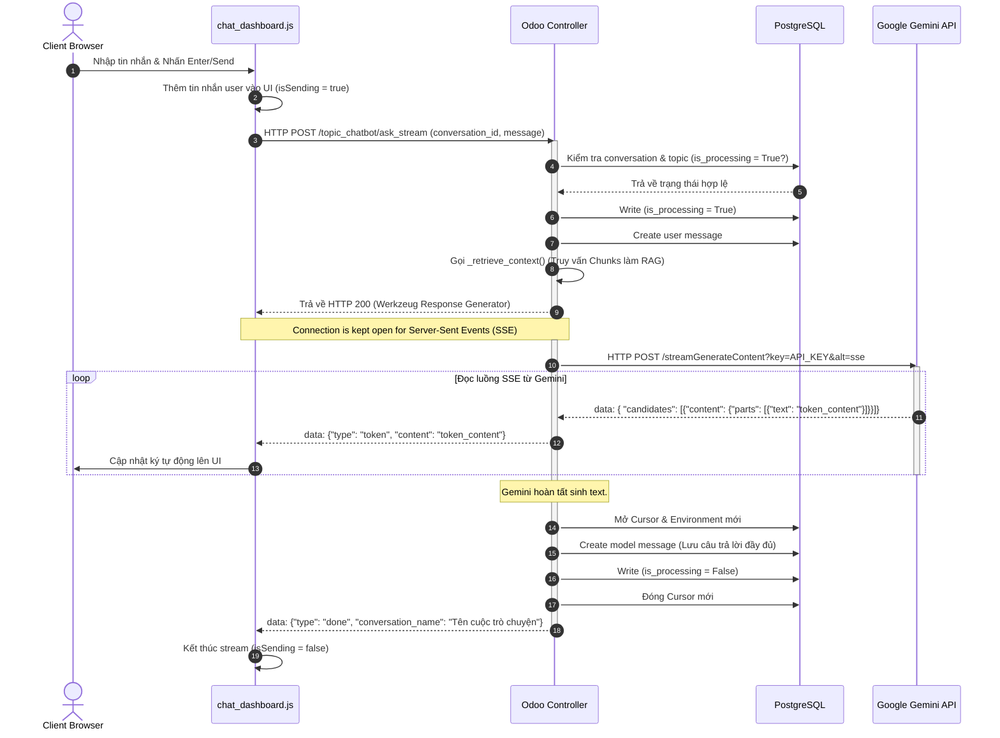
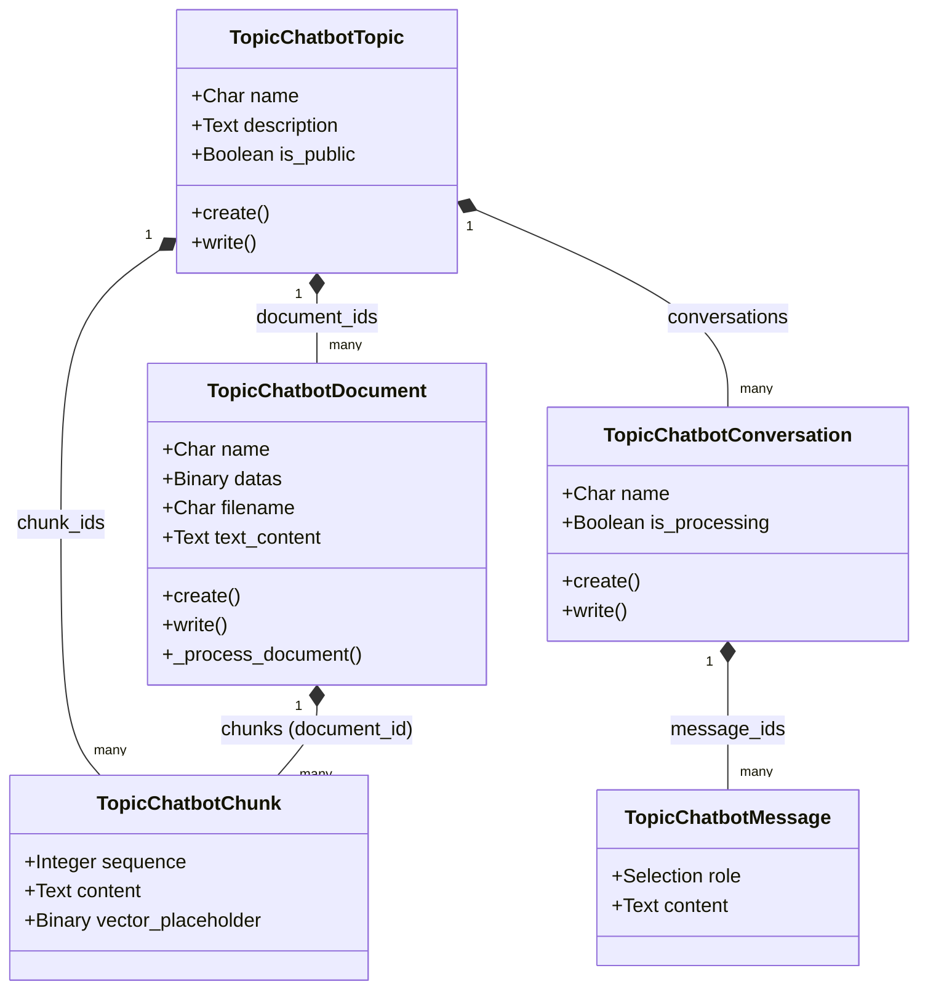

# Kiến trúc kỹ thuật Module Topic Chatbot (RAG)

Tài liệu này mô tả chi tiết kiến trúc hệ thống, luồng xử lý dữ liệu và sơ đồ tuần tự của module `topic_chatbot`. Đây là tài liệu thiết kế hệ thống dành cho Senior Developer và Tech Lead.

---

## 1. Overall Architecture (Kiến trúc tổng quan)

Hệ thống được xây dựng trên nền tảng Odoo 17, tích hợp mô hình ngôn ngữ lớn (LLM) **Google Gemini API** và kỹ thuật **RAG (Retrieval-Augmented Generation)** để trả lời câu hỏi dựa trên các tài liệu được tải lên.

Hệ thống bao gồm 3 lớp chính:
* **Frontend Layer (Owl Component):** Dashboard chat thời gian thực hiển thị dưới dạng toàn màn hình, giao tiếp với backend qua JSON-RPC (cho các tác vụ thường) và Fetch API (cho luồng Server-Sent Events).
* **Backend Controller & Model Layer (Odoo Web & ORM):** Phục vụ các API HTTP/JSON, thực thi phân quyền (Record Rules), tiền xử lý tài liệu (PDF/DOCX), và thực hiện cơ chế RAG.
* **Database & Search Layer (PostgreSQL):** Lưu trữ thực thể và thực hiện tìm kiếm toàn văn bản (Full-Text Search - FTS) sử dụng bộ giải pháp `tsvector` đơn giản kết hợp thuật toán xếp hạng từ khóa bằng Python.

```
+-----------------------------------------------------------+
|                      Frontend (Owl)                       |
+-----------------------------------------------------------+
         | (JSON-RPC)                      ^ (SSE Stream)
         v                                 |
+-----------------------------------------------------------+
|                   Odoo Controllers / ORM                  |
+-----------------------------------------------------------+
         |                                 | (HTTP API)
         v                                 v
+-----------------------+         +-------------------------+
|      PostgreSQL       |         |       Gemini API        |
+-----------------------+         +-------------------------+
```

---

## 2. Module Structure (Cấu trúc thư mục)

Cấu trúc thư mục hiện tại của module `topic_chatbot`:

```
topic_chatbot/
├── __init__.py
├── __manifest__.py                 # Khai báo cấu hình module và dependency
├── controllers/
│   ├── __init__.py
│   └── main.py                     # Định nghĩa HTTP routing (ask_stream, ask, get_messages...)
├── data/
│   └── fts_index.xml               # Tạo GIN index cho Full-Text Search
├── models/
│   ├── __init__.py
│   ├── topic.py                    # Thực thể Chủ đề tài liệu
│   ├── document.py                 # Thực thể Lưu trữ tài liệu & hàm parse text
│   ├── chunk.py                    # Thực thể Lưu trữ phân mảnh văn bản + GIN index FTS
│   ├── conversation.py             # Thực thể Quản lý phiên hội thoại
│   ├── message.py                  # Thực thể Lưu trữ tin nhắn (User và Model)
│   └── res_config_settings.py      # Cấu hình API key & Model của Gemini
├── security/
│   ├── ir.model.access.csv         # Phân quyền truy cập mô hình (ACL)
│   └── security.xml                # Định nghĩa nhóm (Groups) và quy tắc truy cập (Record Rules)
├── static/
│   └── src/
│       └── components/
│           └── chat_dashboard/     # Mã nguồn JS/XML/SCSS của dashboard chat
│               ├── chat_dashboard.js
│               ├── chat_dashboard.scss
│               └── chat_dashboard.xml
└── views/
    ├── topic_views.xml             # Giao diện quản lý Topic/Document ở backend
    ├── res_config_settings_views.xml
    └── menus.xml
```

---

## 3. Data Flow (Luồng dữ liệu tổng quát)

1. **Upload tài liệu:** Admin/User tải file lên hệ thống -> Tách văn bản thô -> Cắt nhỏ thành các phân mảnh (Chunks) -> Lưu vào database.
2. **Hỏi đáp RAG:** User gửi câu hỏi từ Frontend -> Backend nhận câu hỏi -> Truy vấn PostgreSQL để tìm các Chunks có độ tương quan cao -> Tạo System Instruction chứa Context -> Gọi Gemini API (kèm Tools kết nối dữ liệu Odoo nếu cần) -> Đẩy kết quả dạng stream về Frontend -> Lưu tin nhắn vào DB.

---

## 4. Chat Request Lifecycle (Vòng đời yêu cầu Chat)

```
[Client Send Message]
         |
         v
[Controller: ask_stream] ---- (is_processing == True?) ----> Yes: Return Error (400/200)
         | No
         v
[Write: is_processing = True]
         |
         v
[Create: topic_chatbot.message (user)]
         |
         v
[Call: _retrieve_context()] ----> [Search PG Chunks] ---> [System Instruction Context]
         |
         v
[Return HTTP Response (Werkzeug Response Generator)]
         | (End of Request Context / DB Transaction Committed / Cursor Closed)
         v
[WSGI Server starts consuming Generator]
         |
         v
[Call: Gemini API streamGenerateContent]
         |
    +----+----+ (Gemini Response)
    |         |
    v (Token) v (Function Call)
[Yield Token] [Execute: query_odoo_data] ---> [Re-submit to Gemini]
    |
    v (DONE Event)
[Create new DB Cursor & Environment]
    |
[Create: topic_chatbot.message (model)]
    |
[Write: is_processing = False]
    |
[Close new DB Cursor]
```

---

## 5. Async Queue Lifecycle (Vòng đời hàng đợi không đồng bộ)

> [!NOTE]
> **Hiện trạng trong mã nguồn:** Module này **không sử dụng** bất kỳ cơ chế hàng đợi không đồng bộ nào (ví dụ: `queue.job` hay celery).
> Các tác vụ xử lý tệp tin (tách chữ từ PDF/DOCX, sinh chunks) đều được thực hiện **đồng bộ (synchronously)** ngay trong luồng request của Odoo thông qua các phương thức `create` và `write` trên model `topic_chatbot.document`.

---

## 6. Storage Flow (Luồng lưu trữ dữ liệu)

* **Tập tin gốc:** Nội dung tập tin tải lên dạng Base64 được lưu trữ trong trường `datas` (`fields.Binary`, `attachment=True`) của model `topic_chatbot.document`. Với `attachment=True`, Odoo lưu file vào `ir.attachment` (filestore) thay vì database, giảm áp lực DB và giúp backup nhẹ hơn.
* **Văn bản thô:** Toàn bộ chữ sau khi tách từ PDF/DOCX/TXT sẽ được lưu vào trường `text_content` (`fields.Text`) của model `topic_chatbot.document`.
* **Phân mảnh văn bản:** Được cắt nhỏ và lưu trữ tập trung tại bảng `topic_chatbot_chunk` (`topic_chatbot.chunk`) và liên kết ngược về `document_id` và `topic_id`.

---

## 7. Attachment Flow (Luồng tệp đính kèm)

Module này không kế thừa mô hình `mail.thread` hay `ir.attachment` để đính kèm tệp cho chatbot. Thay vào đó, tài liệu tham khảo được cấu hình độc lập qua thực thể `topic_chatbot.document`, mỗi tài liệu được liên kết cứng vào một `topic_chatbot.topic`. Khi xử lý tệp, mã nguồn tự động đọc dữ liệu từ trường `datas` để phân tích.

---

## 8. RAG Retrieval Flow (Luồng tìm kiếm ngữ cảnh)

Hàm `_retrieve_context` tại [main.py](file:///C:/Sonha/odoo_pycharm/custom-addons/odoo-customize/topic_chatbot/controllers/main.py) thực hiện quy trình tìm kiếm ngữ cảnh:

1. **Tiền xử lý chuỗi:** Loại bỏ ký tự đặc biệt, chuyển sang dạng chữ thường (lowercase) và phân rã thành danh sách các từ.
2. **Lọc từ dừng (Stopwords):** Loại bỏ các từ vô nghĩa trong tiếng Việt/Anh thông qua hằng số `STOP_WORDS`.
3. **Phân quyền truy cập:** Thực hiện kiểm tra quyền truy cập của User hiện tại với Topic đang chat qua hàm `search()` của ORM (để kích hoạt Record Rules).
4. **Tìm kiếm toàn văn bản (FTS):**
   * Sử dụng câu lệnh SQL truy vấn trực tiếp bảng `topic_chatbot_chunk`.
   * Sử dụng hàm `to_tsvector('simple', content) @@ plainto_tsquery('simple', %s)` của PostgreSQL để tìm kiếm nhanh các bản ghi chứa từ khóa.
5. **Cơ chế dự phòng (Python Fallback Ranking):**
   * Nếu PostgreSQL FTS gặp lỗi, hệ thống chuyển sang dùng câu lệnh `ILIKE` với mệnh đề `OR` và `ESCAPE '='` của postgres để lấy ra tối đa 100 bản ghi tiềm năng.
   * Sử dụng Python để đếm số lần xuất hiện của các từ khóa trong nội dung mảnh (`content_lower.count(word)`).
   * Sắp xếp danh sách giảm dần theo số lượng từ khớp và trả về tối đa `limit=5` mảnh có điểm cao nhất làm ngữ cảnh.

---

## 9. Streaming Flow (Luồng dữ liệu Stream)

Route `/topic_chatbot/ask_stream` trả về kiểu dữ liệu `text/event-stream`. Luồng dữ liệu stream được kiểm soát thông qua một hàm Generator `generate()` lồng bên trong controller:

* Sử dụng cơ chế phát trực tiếp SSE của Google Gemini qua tham số đường dẫn `alt=sse`.
* Hàm `generate()` đọc dữ liệu dạng byte từ kết nối HTTP (`stream=True`), chuyển hóa và phân tích gói tin JSON SSE dạng `data: {...}`.
* Nếu gói tin chứa phần tử `text`, generator lập tức gửi gói tin SSE có định dạng:
  `data: {"type": "token", "content": "<nội dung text>"}` về frontend.
* **Cơ chế Tool Call Loop (Truy cập dữ liệu Odoo):**
  * Nếu Gemini trả về `functionCall` gọi hàm `query_odoo_data`:
    1. Generator tạm dừng đọc luồng và yield gói tin trạng thái: `data: {"type": "status", "content": "..."}`.
    2. Gọi phương thức nội bộ `_execute_odoo_query` để truy xuất an toàn dữ liệu từ các model cho phép (`hr.employee`, `hr.department`, `sonha.kpi.result.month`, `report.kpi.month`, `sonha.kpi.year`).
    3. Thêm kết quả trả về vào lịch sử hội thoại dưới vai trò `tool` và tiếp tục gửi lại yêu cầu lên Gemini API để tổng hợp kết quả mới.
* **Kết thúc luồng:**
  * Khi luồng hoàn tất, generator mở một Database cursor mới (`registry.cursor()`), khởi tạo môi trường Odoo độc lập và lưu trữ phản hồi của bot vào database, cập nhật tên hội thoại mới, reset cờ `is_processing` về `False` và gửi sự kiện kết thúc:
    `data: {"type": "done", "conversation_name": "<tên mới>"}`.

---

## 10. Sequence Diagram (Sơ đồ tuần tự)



---

## 11. Class Dependency (Phụ thuộc thực thể)



---

## 12. Extension Points (Khả năng mở rộng)

1. **Tìm kiếm Vector (Vector Search):** Trường `vector_placeholder` (`fields.Binary`) trên model `topic_chatbot.chunk` được thiết kế sẵn để lưu trữ mảng vector embedding. Trong tương lai, có thể thay thế Postgres FTS bằng pgvector hoặc thư viện tìm kiếm tương tự để triển khai RAG ngữ nghĩa (Semantic Search).
2. **Odoo Database Tools:** Lớp chức năng `query_odoo_data` kiểm soát bởi hàm `_execute_odoo_query` trong controller có thể được mở rộng bằng cách thêm các model kỹ thuật khác vào danh sách trắng `safe_models` để tăng phạm vi tương tác dữ liệu cho AI.

---

## 13. Risks (Các điểm rủi ro hệ thống)

1. **Xử lý tệp tin đồng bộ (Synchronous File Processing):** Khi người dùng tải lên các file PDF/DOCX có kích thước lớn hoặc chứa quá nhiều trang, phương thức `_process_document()` chạy đồng bộ trong luồng request chính sẽ chiếm dụng toàn bộ tài nguyên của Worker thread Odoo đó trong thời gian dài, dễ dẫn đến lỗi Timeout HTTP từ Nginx hoặc làm đứng hệ thống.
2. **Không có giới hạn Token cho Lịch sử chat:** Hàm `ask_stream` chỉ đơn thuần lấy 20 tin nhắn gần nhất (`limit=20`) mà không tính toán số lượng token tích lũy. Nếu các tin nhắn này chứa nội dung hoặc bảng dữ liệu quá lớn, payload gửi lên Gemini sẽ vượt quá giới hạn Token đầu vào của API, gây lỗi.
3. **Hiệu năng của Python Fallback Ranking:** Khi Postgres tsvector search thất bại, câu truy vấn fallback sẽ tải tối đa 100 phân mảnh lên RAM và thực thi đếm chuỗi bằng Python. Thao tác này tiêu tốn nhiều RAM của server khi số lượng yêu cầu đồng thời tăng cao.

---

## 14. Architecture Issues (Các điểm bất hợp lý trong kiến trúc)

Qua phân tích mã nguồn thực tế, Tech Lead ghi nhận các điểm bất hợp lý cần được nâng cấp trong các phiên bản tiếp theo:

> [!WARNING]
> * **Xử lý tác vụ nặng trong Web Thread:** Việc tách chữ và tạo chunk cho tài liệu nên được đẩy xuống hàng đợi không đồng bộ (Async Queue) để tránh làm nghẽn worker xử lý HTTP của Odoo.
> * **Streaming Response trên Web Worker truyền thống:** Việc mở kết nối HTTP trực tiếp và giữ kết nối bằng generator trong controller Odoo không tương thích tốt với môi trường Web Server đa luồng/tiến trình truyền thống (như Gunicorn/Uwsgi không cấu hình gevent). Điều này có thể làm cạn kiệt số lượng worker khả dụng trên hệ thống chỉ với một vài user chat đồng thời.
> * ~~**Sử dụng Raw SQL không cấu hình Indexes cho FTS:** Câu truy vấn Full-Text Search trong `_retrieve_context` đang sử dụng hàm `to_tsvector` trực tiếp mà không khai báo cột index loại `gin(to_tsvector(...))` trên bảng `topic_chatbot_chunk`. Khi số lượng chunks lên tới hàng triệu, tốc độ tìm kiếm RAG sẽ suy giảm nghiêm trọng do database phải thực hiện quét toàn bảng (Sequential Scan).~~ **ĐÃ FIX (Session 1):** Thêm GIN index `topic_chatbot_chunk_content_fts_index` trên `topic_chatbot_chunk` tại `data/fts_index.xml`.

---

## 15. Changelog

### Session 1 (2026-07-27)
- **Refactor:** System prompt extracted to `_build_system_instruction()` — eliminate ~200 lines of duplication.
- **Bug fix:** Admin conversation rule changed from `[('user_id', '=', user.id)]` to `[(1, '=', 1)]` — admin can now audit all conversations.
- **Cleanup:** Removed dead code `_format_context_chunk()`.
- **Bug fix:** `ask()` now tracks `bot_reply_saved` flag and deletes orphan user messages on API failure.
- **Performance:** Added GIN index `topic_chatbot_chunk_content_fts_index` on `to_tsvector('simple', content)` for FTS.
- **Storage:** Added `attachment=True` to `datas` field — documents now stored in filestore via `ir.attachment`.
- **New file:** `data/fts_index.xml` — module data file to create GIN index on install.
